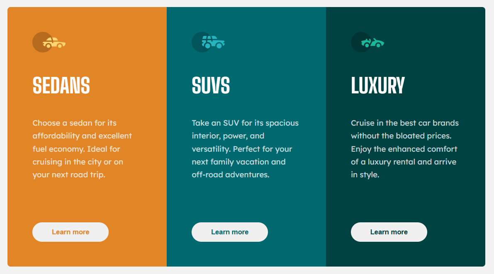

# Frontend Mentor - Nome do Projeto



## 🚀 Descrição

Este é um desafio do [Frontend Mentor](https://www.frontendmentor.io). O objetivo foi recriar o layout fornecido e garantir que ele fosse responsivo e fiel ao design.

💡 **Objetivo:** Melhorar minhas habilidades em desenvolvimento frontend.

## 🔗 Links

- **[Site online](https://alisonlim4.github.io/3-column-preview-card-component/)**
- **[Repositório](https://github.com/AlisonLim4/3-column-preview-card-component/tree/main)**

## 🛠️ Como Rodar Localmente

1. Clone o repositório:

```bash
git clone https://github.com/seu-usuario/nome-do-repo.git
```

2. Abra o arquivo `index.html` em seu navegador.

## 🧪 Tecnologias Utilizadas

- HTML5
- CSS3

## 🌟 O Que Eu Aprendi

- Como utilizar data-type
- Utilização de variaveis
- Mobile first

## 🚀 Melhorias Futuras

- Adicionar uma versão dark mode

## 👨‍💻 Autor

Desenvolvido por [Alison Lima](https://github.com/AlisonLim4).
